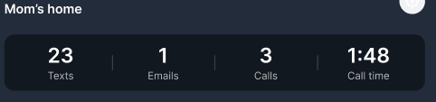
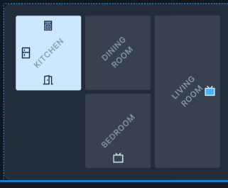
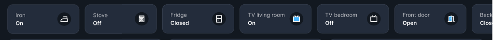
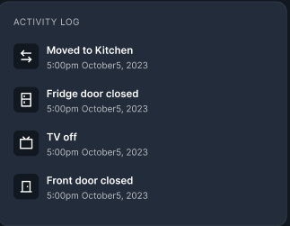
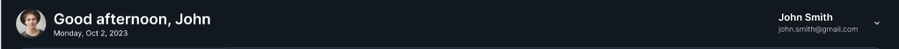
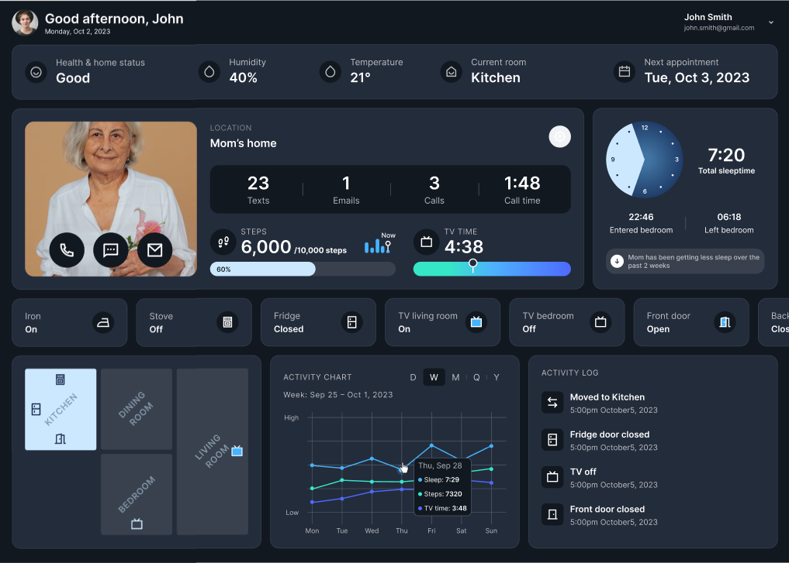

# Task Description

**Carefully read the task description and check all the links provided.**

## 🤓 Task
You are tasked with developing a dashboard based on a design from Figma. Also, this dashboard needs to be connected to a ready-made server.

1. The design of the dashboard should match the Figma layout, without any extra creativity from the candidate.
2. Design adaptability is **NOT** required.
3. Use React as the primary technology.
4. You **CAN** utilize third-party libraries, but **CAN'T** use third-party services.
5. Familiarize yourself with SSE (Server Sent Events).

### What should be connected to the server

1. Mom's home feed: \
 \
2. Mom's current location: \
 \
3. Status bar: \

4. Activity log: \
 \
5. Profile: \
 \

## ❓ SSE (Server Sent Events)
To learn more about SSE (Server Sent Events), refer to [this link](https://developer.mozilla.org/en-US/docs/Web/API/Server-sent_events/Using_server-sent_events).

## ⚠️ Requirements
- Instead of forking this repository, create your own.
- Your repository should include an instructions how to run your application. 
- You should provide **ONLY** Frontend project (files), **WITHOUT** server files from this repository
- To work with the server, follow these steps:
  - Install the necessary packages with the command `npm install`.
  - Start the server using the `npm start` command. It will run on port 3001.
  - **Documentation** for the server is available at `/docs`.

## ❌ What is not acceptable
- Modifying the dashboard design without specification.
- Modifying server files and putting them in your solution repository. 

## 🤔 Links
### ℹ️ Figma design
https://www.figma.com/file/yGBxK3lSOxaAc5cvpBIs5Z/Dashboard?type=design&node-id=0-1&mode=design&t=cJ72ys5771UbGVY5-0

### ✅ Screenshot of the dashboard: 
